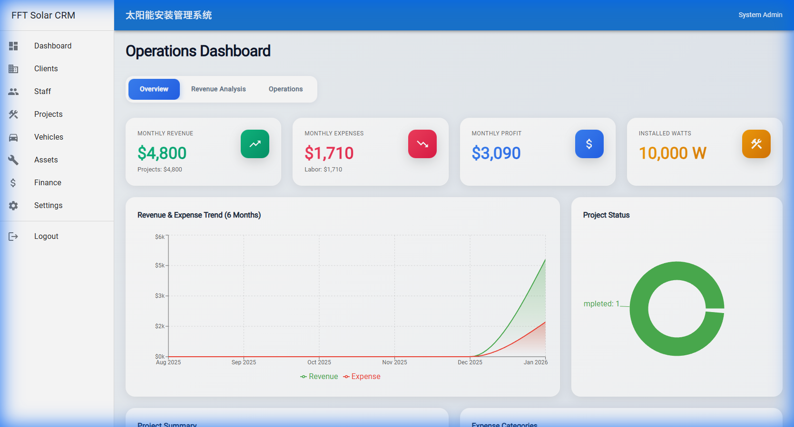
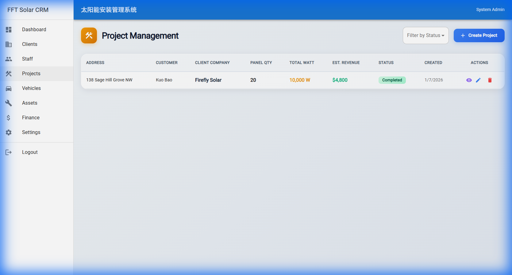
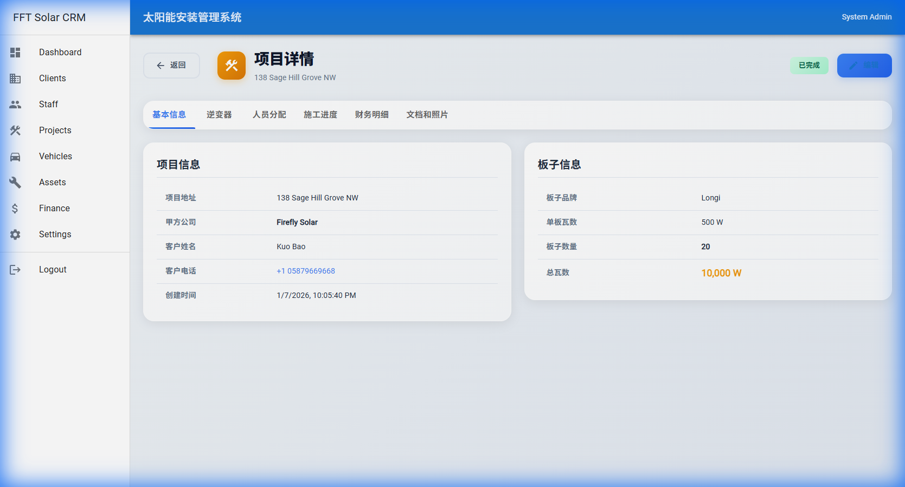
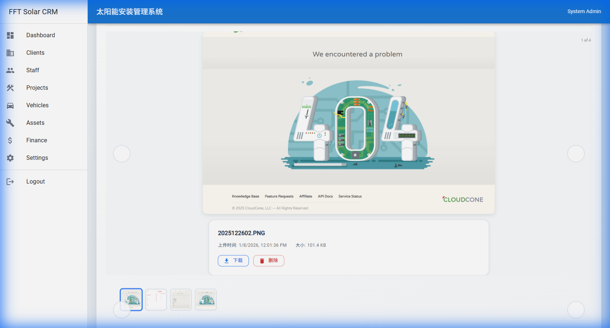

# FFT Solar CRM

> 🌞 A comprehensive CRM management system for solar installation companies


## 📖 Overview

FFT Solar CRM is a full-stack customer relationship management (CRM) system specifically designed for solar panel installation companies. It streamlines project management, client tracking, staff assignments, financial calculations, and document management with an intuitive and modern user interface.

## ✨ Key Features

### 🎯 Core Functionality
- **Dashboard Analytics** - Real-time revenue, expenses, and project status visualization
- **Project Management** - Complete project lifecycle tracking from quote to completion
- **Client Management** - Comprehensive client database with contact history
- **Staff Management** - Employee assignments, payroll calculation, and performance tracking
- **Asset Tracking** - Inventory management for solar panels, inverters, and equipment
- **Vehicle Management** - Company vehicle tracking and maintenance schedules
- **Finance Module** - Automated profit/loss calculations and financial reporting

### 📸 Advanced Features
- **Photo Gallery with Carousel** - Beautiful image carousel for project documentation
  - Optimized 60px thumbnails with rounded corners
  - Smooth navigation with custom circular arrow buttons
  - Responsive design with hover effects
- **Document Upload** - Support for PDFs, images, and office documents
- **Progress Tracking** - Visual construction phase monitoring
- **Export Capabilities** - PDF and Excel export for reports

## 🖼️ Screenshots

### Dashboard Overview

*Real-time analytics showing monthly revenue, expenses, and project status*

### Project Management

*Comprehensive project list with filtering and quick actions*

### Project Details

*Detailed project information with tabs for different aspects*

### Photo Gallery

*Beautiful carousel for project photos with thumbnails and smooth navigation*

## 🛠️ Technology Stack

### Backend
- **Node.js** + **Express** - RESTful API server
- **PostgreSQL** - Relational database
- **Sequelize** - ORM for database operations
- **JWT** - Secure authentication
- **Multer** - File upload handling

### Frontend
- **React** - Modern UI framework
- **Material-UI (MUI)** - Beautiful component library
- **React Router** - Client-side routing
- **Axios** - HTTP client
- **React Responsive Carousel** - Image carousel component

### DevOps
- **Docker** + **Docker Compose** - Containerized deployment
- **Nginx** - Reverse proxy and static file serving
- **Multi-stage builds** - Optimized production images

## 🚀 Quick Start

### Prerequisites
- Docker & Docker Compose
- Git

### Installation

1. **Clone the repository**
```bash
git clone https://github.com/bkcsplayer/fft-solar-helper.git
cd fft-solar-helper
```

2. **Start with Docker Compose**
```bash
docker-compose up -d
```

3. **Access the application**
- Frontend: http://localhost:5201
- Backend API: http://localhost:5200
- Database: localhost:5433

### Default Credentials
```
Username: admin
Password: admin123
```

## 📦 Project Structure

```
fft-solar-crm/
├── client/                 # React frontend application
│   ├── public/
│   ├── src/
│   │   ├── components/    # Reusable UI components
│   │   ├── pages/         # Page components
│   │   ├── services/      # API service layer
│   │   └── App.js         # Main app component
│   ├── Dockerfile         # Frontend container config
│   └── nginx.conf         # Nginx configuration
├── server/                # Express backend API
│   ├── controllers/       # Business logic
│   ├── models/           # Database models (Sequelize)
│   ├── routes/           # API endpoints
│   ├── middleware/       # Auth & validation
│   └── index.js          # Server entry point
├── database/             # Database initialization
│   └── schema.sql        # Database schema
├── docker-compose.yml    # Docker orchestration
├── screenshots/          # Application screenshots
└── README.md            # This file
```

## 🔌 API Documentation

### Authentication
- `POST /api/auth/login` - User login
- `POST /api/auth/register` - User registration

### Projects
- `GET /api/projects` - List all projects
- `GET /api/projects/:id` - Get project details
- `POST /api/projects` - Create new project
- `PUT /api/projects/:id` - Update project
- `DELETE /api/projects/:id` - Delete project

### Clients
- `GET /api/clients` - List all clients
- `GET /api/clients/:id` - Get client details
- `POST /api/clients` - Create new client

### Files
- `POST /api/files/upload` - Upload project files
- `GET /uploads/:path` - Serve uploaded files
- `DELETE /api/files/:id` - Delete file

*Full API documentation coming soon*

## 🐳 Docker Deployment

The application uses a multi-container setup:

- **frontend** - React app served by Nginx (Port 5201)
- **backend** - Node.js API server (Port 5200)
- **database** - PostgreSQL database (Port 5433)

### Environment Variables

Create a `.env` file in the root directory:

```env
# Database
DB_HOST=database
DB_PORT=5432
DB_NAME=fft_solar_crm
DB_USER=postgres
DB_PASSWORD=postgres

# JWT
JWT_SECRET=your_secret_key_here
JWT_EXPIRES_IN=7d

# Server
PORT=5200
NODE_ENV=production

# File Upload
UPLOAD_DIR=./uploads
MAX_FILE_SIZE=10485760
```

## 🔧 Development

### Local Development (without Docker)

1. **Install dependencies**
```bash
npm run install-all
```

2. **Start development servers**
```bash
npm run dev
```

This starts:
- Backend server on http://localhost:5200
- Frontend dev server on http://localhost:3000

## 🎨 Features Highlights

### Optimized Image Carousel
Recent v1.0 includes a beautifully redesigned photo carousel:
- Small, elegant 60px × 60px thumbnails
- Circular navigation buttons with hover effects
- Smooth transitions and responsive design
- Blue accent colors matching the overall theme

### Financial Calculations
Automatic calculation of:
- Project revenue based on watt × rate
- Staff payroll (per-panel or per-project)
- Profit/loss analysis
- Monthly financial trends

### Smart File Management
- Organized uploads by project
- Support for multiple file types
- Download and delete capabilities
- Nginx-optimized static file serving

## 📝 Version History

### v1.0.0 (2026-01-08)
- ✅ Complete CRM functionality for solar installations
- ✅ Docker deployment ready
- ✅ Beautiful photo carousel with optimized styling
- ✅ Fixed port configuration (52xx series)
- ✅ Nginx reverse proxy for production
- ✅ Comprehensive project, client, and staff management

## 🤝 Contributing

Contributions are welcome! Please feel free to submit a Pull Request.

## 📄 License

This project is licensed under the MIT License.

## 👨‍💻 Author

Created for FFT Solar installation company management needs.

## 🙏 Acknowledgments

- Material-UI for the beautiful component library
- React Responsive Carousel for the image gallery
- Docker for simplified deployment

---

**Note**: This is a production-ready v1.0 release. For questions or support, please open an issue on GitHub.
